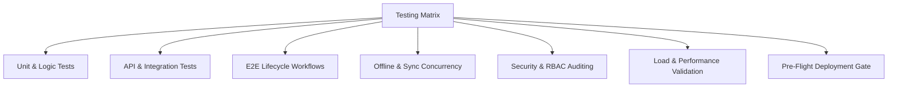

# RentBuddy ERP — Production Hardcoding Remediation & Zero-Bug QA Plan

This document outlines the step-by-step engineering plan to eliminate all hardcoded configurations, secrets, mock values, and bypasses from the RentBuddy ERP repository, followed by an end-to-end testing and verification strategy to achieve production-grade stability (zero-bug quality gate).

---

## Part 1: Hardcoding Remediation Plan

### 1. Security & Secrets Isolation
* [ ] **Eliminate Cleartext Database URIs in Code**:
  * Remove fallback MongoDB Atlas connection strings from `backend/config/db.js`, `backend/scripts/clear_test_driver.js`, and `backend/scripts/seed_admin.js`.
  * Ensure the server refuses to boot in production if `MONGODB_URI` is not provided in the environment.
  * Add `.env.example` template with dummy placeholder keys.
  * Ensure `.env` is strictly ignored in `.gitignore` and rotate any exposed database credentials.
* [ ] **Eliminate Hardcoded JWT Secret**:
  * Remove `'super_secret_key_rentbuddy_2026_!!'` fallback in `backend/config/constants.js`.
  * Throw an immediate startup error if `JWT_SECRET` is missing in production environment (`process.env.NODE_ENV === 'production'`).
* [ ] **Remove Hardcoded Default Passwords**:
  * Remove `'RentbuddySecure2026!'` and `'admin123'` fallback passwords from `backend/config/constants.js` and `backend/scripts/seed_admin.js`.
  * Enforce dynamic initialization CLI command `npm run seed:admin` where the administrator specifies credentials via secure prompt or strictly via environment variables (`INITIAL_ADMIN_PASSWORD`).
  * Remove the "Default Administrator Credentials" callout box from `src/views/Login.tsx`.
* [ ] **Remove Driver Authentication Backdoors / Test Bypasses**:
  * In `backend/controllers/auth.controller.js`:
    * Remove the hardcoded `'1234'` PIN bypass in `loginDriverWithPin`.
    * Remove the hardcoded fallback name `'Faisal Rabani'` in driver login response payload.
    * Replace default PIN `'1234'` in `src/views/LogisticsDetailDocument.tsx` with a secure auto-generated 4-digit numeric PIN during onboarding.
  * In `backend/scripts/clear_test_driver.js`:
    * Parameterize test phone numbers via CLI argument or environment variable rather than hardcoding `'7008452720'`.

---

### 2. Centralized & Dynamic Networking Configuration
* [ ] **Centralize Frontend API Base URL**:
  * Create a single source of truth HTTP client utility: `src/api/client.ts` (or Axios/Fetch wrapper).
  * Read `import.meta.env.VITE_API_URL` with a fallback to relative `/api/v1` (for reverse proxies/production domain matching).
  * Replace hardcoded `http://localhost:5001/api/v1` in:
    * `src/store/rentBuddyStore.ts`
    * `src/views/Settings.tsx`
    * `src/views/OrderManagement.tsx`
* [ ] **Backend Dynamic Port & CORS Configuration**:
  * Configure allowed CORS origins via `CORS_ORIGIN` environment variable in `backend/config/constants.js` and `backend/app.js`.

---

### 3. Business Profile & Multi-Branch Entity Configuration
* [ ] **Dynamic Organization Settings**:
  * Move hardcoded GSTIN (`23AABCR8901L1Z5`), Head Office address (`Plot 45, Scheme 54, Indore`), and contact phone numbers into a database-backed `OrganizationConfig` model and a Zustand settings state.
  * In `src/components/BarcodeStickerModal.tsx` and `src/views/Quotations.tsx`, dynamically render values from active store organization settings.
* [ ] **Dynamic Branch & Warehouse Management**:
  * Fetch cities and warehouse locations dynamically from MongoDB (`/api/v1/cities` or `/api/v1/warehouses`) instead of static arrays in `src/store/rentBuddyStore.ts` and `backend/config/initialData.js`.

---

### 4. Media & Document Placeholders
* [ ] **ImageKit & Cloud Storage Enforcements**:
  * Prevent fallback to hardcoded Unsplash sample URLs across `src/views/LogisticsDetailDocument.tsx`, `src/views/CustomerManagement.tsx`, and `backend/controllers/auth.controller.js`.
  * Implement clean, branded SVG fallback avatars and document placeholder badges when a customer or driver document has not yet been uploaded.

---

### 5. Dynamic Analytics & Dashboard Metric Aggregation
* [ ] **Transform Static Dashboard SVGs to Live Computed Metrics**:
  * In `src/views/Dashboard.tsx`:
    * Replace hardcoded donut chart slices (50%, 35%, 15%) with real calculations from `inventory.filter(a => a.lifecycle.currentCondition === ...)`.
    * Replace static top category counts (Beds: 42, Sofa: 29, Fridge: 18) with real aggregation from `orders.flatMap(o => o.items)`.
    * Replace fixed city revenue breakdown (IND 55%, BHO 20%, SUR 15%, AHM 10%) with dynamic aggregation from `invoices.reduce(...)` grouped by city.

---

## Part 2: Comprehensive Production Quality (Zero-Bug) Testing Plan

To ensure enterprise-grade stability, zero regressions, and full resilience across online and offline states, the testing plan spans 7 core dimensions:

---

### Stage 1: Unit & Business Logic Testing
* **Target Coverage**: $\ge 90\%$ logic coverage.
* **Scope**:
  * **Financial Engine**:
    * Rental pricing, monthly billing schedule generation, and pro-rata rent calculations.
    * Flat vs. percentage discount computations and minimum deposit protections.
    * Deposit deductions, late fee calculations, and damage cost settlements.
  * **Inventory State Machine**:
    * Asset lifecycle state transitions: `Available` $\to$ `Reserved` $\to$ `Loaded` $\to$ `Delivered` $\to$ `Under Return` $\to$ `Inspected` $\to$ `Available / Under Repair / Scrap`.
    * Barcode validation and duplicate barcode detection algorithms.
  * **Driver KYC & Verification Engine**:
    * Validation for Indian Mobile Numbers (10 digits), Aadhaar (12 digits / Verhoeff algorithm check), Driving License format, and UPI IDs.

---

### Stage 2: Backend API & Contract Testing (Supertest / Vitest)
* **Authentication & RBAC Testing**:
  * Verify token issuance, expiration, and refresh mechanisms.
  * Verify access restriction across all 8 user roles:
    * `Super Admin`: Unrestricted access.
    * `Operations Manager`: Orders, inventory, and logistics access; blocked from staff password reset.
    * `Logistics Team`: Restricted to dispatch, driver assignment, and barcode scanning.
    * `Read-only Auditor`: All mutation endpoints (`POST`, `PUT`, `DELETE`) must return `403 Forbidden`.
* **Driver App API Testing**:
  * Driver OTP generation, expiration (5 min TTL), attempt limiting (max 3 tries), and verification.
  * Driver PIN authentication, password reset, and profile updates.
  * Proof of delivery upload (`POST /api/v1/deliveries/proof`) with geolocation coords and image payloads.
* **CRUD & Sync Contract Validation**:
  * Order creation with KYC gate rejection if customer is unverified.
  * Sync payload endpoint (`POST /api/v1/sync`) handling bulk asset and order state updates cleanly.

---

### Stage 3: End-to-End (E2E) Real-World User Journeys (Playwright)
* **Journey 1: Customer Onboarding to Order Dispatch**:
  1. Onboard new customer in `CustomerManagement.tsx` $\to$ upload Aadhaar/PAN.
  2. Verify customer KYC in compliance tab.
  3. Create POS rental order in `PointOfSale.tsx` $\to$ select available assets $\to$ apply coupon $\to$ checkout.
  4. Verify asset state automatically transitions from `Available` to `Reserved`.
* **Journey 2: Logistics, Driver Assignment & Delivery Verification**:
  1. Assign verified driver to the order in `OrderManagement.tsx` or `LogisticsLog.tsx`.
  2. Simulate driver scanning barcode at warehouse dispatch.
  3. Complete delivery in `LogisticsDetailDocument.tsx` with OTP / signature $\to$ verify order marks `Delivered` and asset marks `Rented`.
* **Journey 3: Return Inspection, Damage Settlement & Deposit Refund**:
  1. Initiate return pickup request $\to$ order moves to `Return Pickup`.
  2. Perform return inspection in `ReturnInspection.tsx` (scratches, cleanliness, broken parts).
  3. If damaged $\to$ auto-create repair job in `RepairDashboard.tsx` and deduct damage cost from deposit.
  4. Refund remaining security deposit $\to$ verify financial ledger entry in `FinancePortal.tsx`.

---

### Stage 4: Offline-First & Realtime Sync Resilience
* **Network Interruption Tests**:
  * Disconnect network while performing POS checkout $\to$ verify order is safely queued in local Zustand/LocalStorage store.
  * Reconnect network $\to$ verify debounced sync engine flushes queue to MongoDB Atlas without payload corruption.
* **Concurrent Multi-Tab Conflict Tests**:
  * Open ERP in two separate browser windows simultaneously.
  * Rent an item in Window A $\to$ verify Window B receives sync update or prevents double-booking of the same barcode asset.
* **Local Storage Quota & Hydration**:
  * Verify large inventory catalogs (5,000+ items) hydrate into memory without UI freeze or LocalStorage quota exceeded errors.

---

### Stage 5: Security, Rate Limiting & Vulnerability Audit
* **Rate Limiter Verification**:
  * Test OTP request endpoint: ensure IP and phone rate limiters trigger after exceeding threshold.
* **Input Sanitization & Injection Testing**:
  * NoSQL injection tests on login (`{"$gt": ""}`) and query parameters.
  * XSS payload testing in customer names, addresses, and notes inputs.
* **CORS & Header Security**:
  * Verify `Helmet` security headers (HSTS, CSP, X-Frame-Options, X-Content-Type-Options).
  * Ensure unauthorized domains receive CORS rejection.

---

### Stage 6: Performance & Load Testing (k6 / Artillery)
* **Concurrent Driver & User Traffic**:
  * 100 concurrent virtual riders querying active delivery tasks and sending geolocations.
  * Response time benchmark: p95 $< 120\text{ms}$ for all read queries; p95 $< 250\text{ms}$ for mutations.
* **MongoDB Indexing Audit**:
  * Ensure indexes on `id`, `phone`, `barcode`, `status`, `city`, `customerId`, and `assignedDriverId` are present and query plans avoid full collection scans (`COLLSCAN`).

---

### Stage 7: Production Release Checklist & Pre-Flight Gate

| Check Item | Requirement | Status |
| :--- | :--- | :---: |
| **No Cleartext Credentials** | Zero database URIs or JWT secrets in source code files | ⏳ Pending |
| **Zero Hardcoded URLs** | All endpoints read from environment variables | ⏳ Pending |
| **Bypasses Removed** | No fallback PINs (`1234`) or hardcoded driver accounts | ⏳ Pending |
| **Dynamic Analytics** | Dashboard charts dynamically aggregate store collections | ⏳ Pending |
| **TypeScript Strictness** | `tsc --noEmit` compiles with 0 errors | ⏳ Pending |
| **Lint & Format** | ESLint / Prettier clean | ⏳ Pending |
| **E2E Suite** | 100% passing core user journeys in Playwright | ⏳ Pending |
| **Database Migrations** | Initial admin creation script parameterized via CLI | ⏳ Pending |
| **Log Management** | Winston/Morgan production logging with masked PII data | ⏳ Pending |
